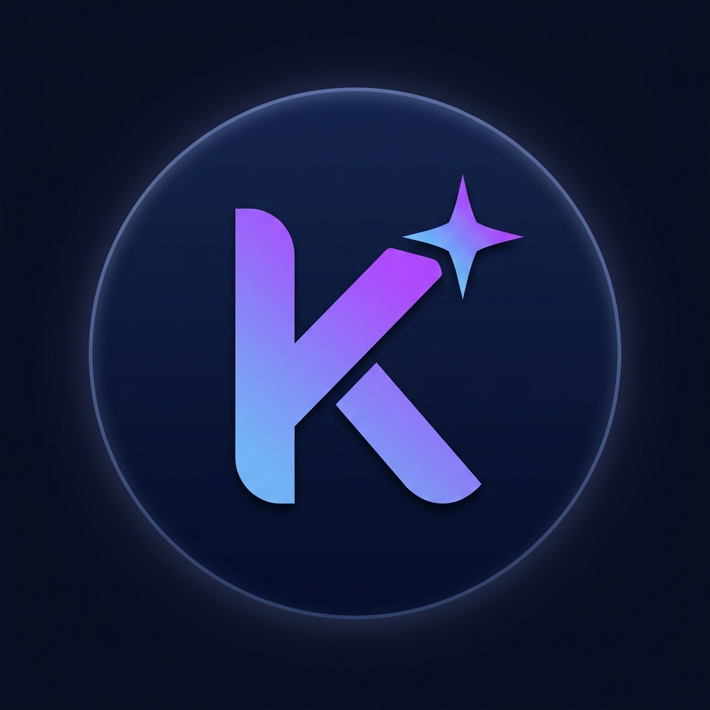

# 🐾 Kodi AI Assistant

Kodi is a production-grade, multimodal AI chatbot powered by the modern Google Gemini SDK. It features a premium glassmorphic interface, multi-key rotation for high availability, and localized persistent storage using SQLite.



## ✨ Key Features

- **🚀 Multimodal Intelligence**: Full support for processing Images, PDFs, and Audio files.
- **🎨 Premium UI/UX**: Stunning glassmorphic design with smooth animations, interactive loaders, and custom toast notifications.
- **🗄️ Persistent History**: Chat sessions are automatically synced to a local SQLite database (`/data/kodi.db`), solving the browser storage quota limits.
- **🔐 Usage Control**: Built-in IP-based rate limiting (10 chats/day) with Cloudflare support to prevent abuse.
- **🔁 API Key Rotation**: Supports multiple Gemini API keys in a round-robin rotation to maximize quota and reliability.
- **🛠️ Developer Friendly**: Includes an "Unlimited Developer Mode" and auto-reloading during development.

## 🛠️ Tech Stack

- **Backend**: Node.js (ES Modules), Express.js
- **Database**: SQLite (via `sqlite3` & `sqlite` wrapper)
- **AI Core**: `@google/genai` (Modern Gemini SDK)
- **Frontend**: Vanilla HTML5, CSS3 (Glassmorphism), JavaScript (ES6+)

## 🚀 Getting Started

### 1. Prerequisites

- [Node.js](https://nodejs.org/) (v18 or higher recommended)
- A Gemini API Key from [Google AI Studio](https://aistudio.google.com/)

### 2. Installation

```bash
# Clone the repository
git clone https://github.com/kumoruBaka/kodi-chatbot.git
cd kodi-chatbot

# Install dependencies
npm install
```

### 3. Configuration

Create a `.env` file in the root directory (refer to `.env.example`):

```env
# Gemini API Key (Support single key or multiple keys separated by semicolon)
GEMINI_API_KEY=your_key1;your_key2
PORT=3000
DEV_MODE=yes
```

### 4. Run the App

```bash
# Development mode with auto-reload
npm run dev
```

Open [http://localhost:3000](http://localhost:3000) in your browser.

## 📁 Project Structure

- `/public` - Frontend assets (HTML, CSS, Favicon)
- `/data` - SQLite database and persistence logic
- `server.js` - Main ESM Express server
- `.env` - Sensitive configuration (Ignored by Git)

## 🤝 Contributors

- **KumoruBaka** - Main Developer & Architect

---

_Made with ❤️ by Raditya Budi Santosa_
